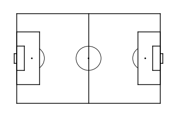
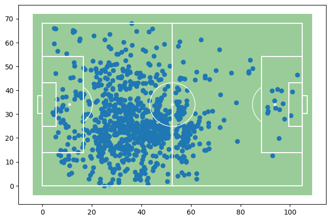
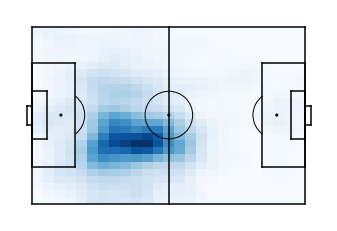

# matplotsoccer

This is a package to visualize soccer data

To install it simply
```
pip install matplotsoccer
```

## 1. Plotting a 105 x 68 soccer field with `matplotsoccer.field()`:



You can also:
- plot a green field with white lines instead of a white field with black lines
- adjust the figure size
- add a scatterplot
- reactivate the axis.
```python
matplotsoccer.field("green",figsize=8, show=False)
plt.scatter(x,y)
plt.axis("on")
plt.show()
```


## 2. Plotting a heatmap with `matplotsoccer.heatmap()`
```python
hm = matplotsoccer.count(x,y,n=25,m=25) # Construct a 25x25 heatmap from x,y-coordinates
hm = scipy.ndimage.gaussian_filter(hm,1) # blur the heatmap
matplotsoccer.heatmap(hm) # plot the heatmap
```


The most important parameters are:
- the color map (any color map accepted by matplotlib will work)
- the color of the field lines
- adding a colorbar to the right of the heatmap
```python
matplotsoccer.heatmap(hm,cmap="hot",linecolor="white",cbar=True)
```


## 3. Plotting soccer event stream data with `matplotsoccer.actions()`
Here is an example of five actions in the SPADL format (see https://github.com/ML-KULeuven/socceraction) leading up to Belgium's second goal against England in the third place play-off in the 2018 FIFA world cup.


|   game_id |   period_id |   seconds | team    | player          |   start_x |   start_y |   end_x |   end_y | actiontype   | result   | bodypart   |
|-----------|-------------|-----------|---------|-----------------|-----------|-----------|---------|---------|--------------|----------|------------|
|      8657 |           2 |      2179 | Belgium | Axel Witsel     |      37.1 |      44.8 |    53.8 |    48.2 | pass         | success  | foot       |
|      8657 |           2 |      2181 | Belgium | Kevin De Bruyne |      53.8 |      48.2 |    70.6 |    42.2 | dribble      | success  | foot       |
|      8657 |           2 |      2184 | Belgium | Kevin De Bruyne |      70.6 |      42.2 |    87.4 |    49.1 | pass         | success  | foot       |
|      8657 |           2 |      2185 | Belgium | Eden Hazard     |      87.4 |      49.1 |    97.9 |    38.7 | dribble      | success  | foot       |
|      8657 |           2 |      2187 | Belgium | Eden Hazard     |      97.9 |      38.7 |   105   |    37.4 | shot         | success  | foot       |


Here is the phase visualized using `matplotsoccer.actions()`
```python
matplotsoccer.actions(
    location=actions[["start_x", "start_y", "end_x", "end_y"]],
    action_type=actions.type_name,
    team=actions.team_name,
    result= actions.result_name == "success",
    label=actions[["time_seconds", "type_name", "player_name", "team_name"]],
    labeltitle=["time","actiontype","player","team"],
    zoom=False
)
```


(c) Tom Decroos 2019
